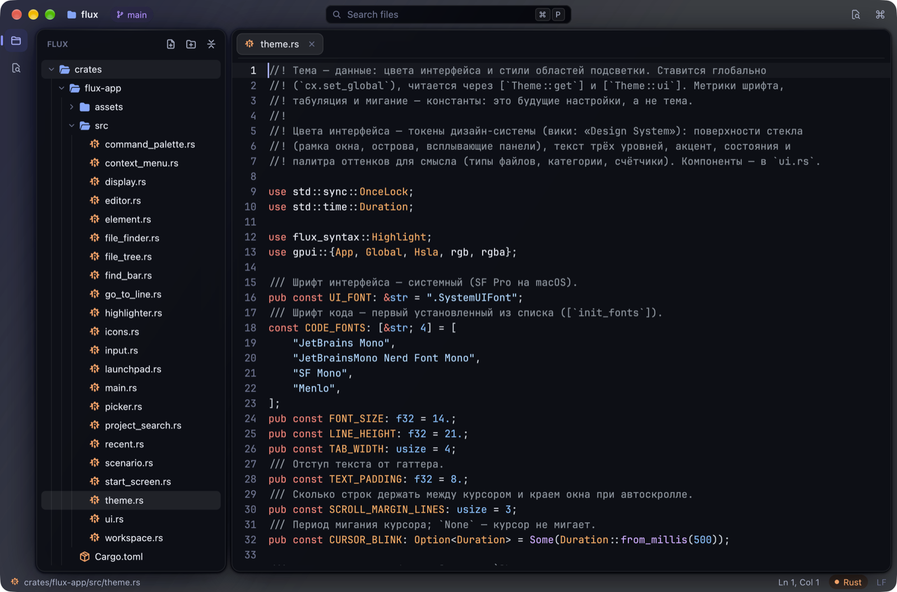
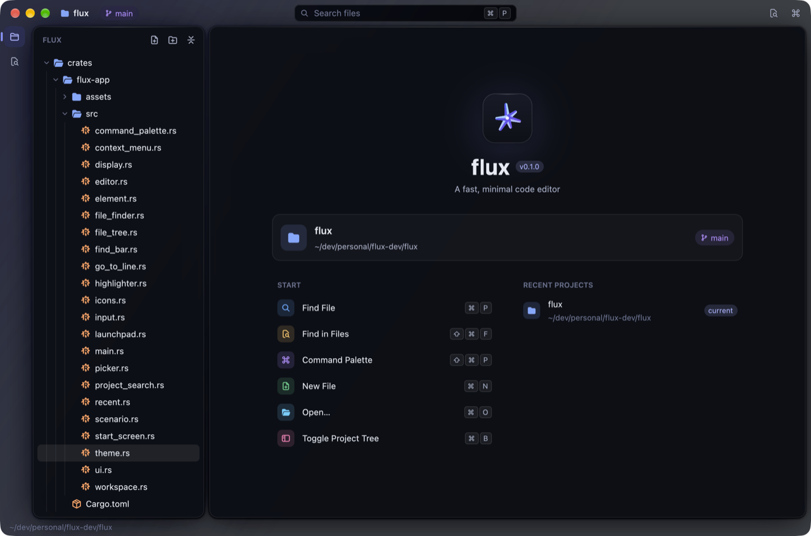
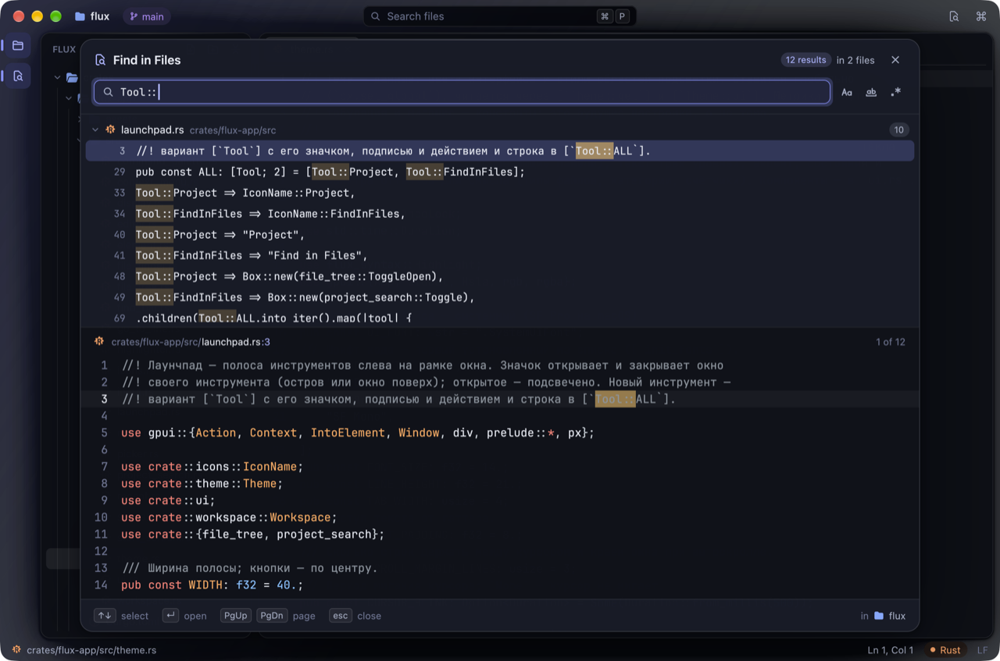
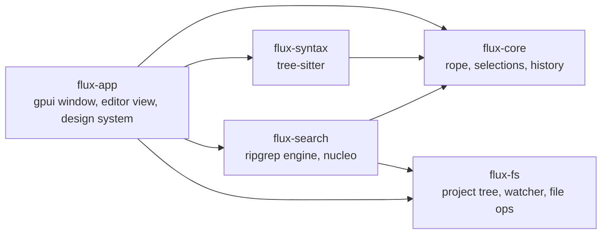

<div align="center">


# flux

**A fast, minimal code editor for macOS — native, GPU-rendered, written in Rust.**

[Features](#features) · [Getting started](#getting-started) · [Shortcuts](#keyboard-shortcuts) · [Architecture](#architecture) · [Roadmap](#roadmap)


</div>

<p align="center">
  
</p>

flux is a code editor that puts speed first: every frame lays out only the lines you can see, syntax
parsing never blocks typing, and every long operation — reading files, walking the project,
searching — runs in the background and can be cancelled. It is built on
[gpui](https://www.gpui.rs), the GPU-accelerated UI framework behind Zed, with a UI-free Rust core
underneath.

> [!NOTE]
> flux is in early development and is shaped by its author's own workflow first. It runs on macOS
> today; Linux comes later. Expect rough edges — and fast iterations.

## Features

- **Instant feedback.** Only visible lines are shaped and painted, so frame cost depends on the
  window, not the file; tree-sitter gets a 1 ms budget inside the frame and finishes in the
  background — a 50 000-line file is editable at once and fully highlighted a moment later.
- **Islands on glass.** A frosted, blurred window frame holds separate rounded islands — the project
  tree and the editor — with dense glass panels on top. The whole UI comes from a small design
  system: colour tokens, components and an icon set, all in code.
- **A real editing core.** Rope storage, multi-cursor for every command, transactions as data,
  grouped undo, IME input and atomic saves that never leave a half-written file.
- **Syntax highlighting** with tree-sitter for Rust, TOML, JSON, Markdown, YAML, Bash, Python, Go,
  JavaScript, TypeScript and TSX — parsed incrementally, edit by edit.
- **Search that keeps up.** A fuzzy file finder (nucleo), **Find in Files** with grouped results and a
  live code preview (ripgrep's search engine), and find & replace with case, whole-word and regex
  modes including capture groups.
- **A project tree that respects `.gitignore`.** Lazy directories, live updates from FSEvents, and
  safe file operations: nothing is ever overwritten, deletions go to the Trash, and open tabs follow
  renamed and moved files.
- **Launchpad.** A tool strip on the left opens the editor's tool windows — the project tree and Find
  in Files today, more as they arrive.
- **Keyboard-first.** A command palette lists every action with its shortcut; key bindings lean
  towards JetBrains (<kbd>⌘</kbd><kbd>⌫</kbd> deletes a line, <kbd>⌘</kbd><kbd>R</kbd> replaces).

<table>
  <tr>
    <td width="50%"></td>
    <td width="50%"></td>
  </tr>
  <tr>
    <td align="center"><sub><b>Start screen</b> — quick actions, recent projects</sub></td>
    <td align="center"><sub><b>Find in Files</b> — grouped results, live preview</sub></td>
  </tr>
</table>

## Getting started

You need macOS and a stable Rust toolchain ([rustup](https://rustup.rs)). Xcode is not required:
gpui compiles its Metal shaders at runtime.

```sh
git clone git@github.com:egor4geev/flux.git
cd flux

cargo run --release -p flux-app -- .              # open the current folder as a project
cargo run --release -p flux-app -- src/main.rs    # open files in tabs

scripts/bundle-macos.sh                           # build target/release/flux.app with its icon
open target/release/flux.app
```

`flux [paths…]` — a folder among the arguments becomes the project root; otherwise flux uses the
git root of the current directory. Files open in tabs. Without files, flux shows the start screen
with quick actions and recent projects.

## Keyboard shortcuts

| Keys | Action |
|------|--------|
| <kbd>⌘</kbd><kbd>P</kbd> | Find a file by name |
| <kbd>⇧</kbd><kbd>⌘</kbd><kbd>F</kbd> | Find in Files |
| <kbd>⇧</kbd><kbd>⌘</kbd><kbd>P</kbd> | Command palette |
| <kbd>⌘</kbd><kbd>F</kbd> · <kbd>⌘</kbd><kbd>R</kbd> | Find · replace in the file |
| <kbd>⌘</kbd><kbd>G</kbd> · <kbd>⇧</kbd><kbd>⌘</kbd><kbd>G</kbd> | Next · previous match |
| <kbd>⌥</kbd><kbd>↵</kbd> | Select all matches as cursors |
| <kbd>⌘</kbd><kbd>L</kbd> | Go to line |
| <kbd>⌘</kbd><kbd>B</kbd> · <kbd>⇧</kbd><kbd>⌘</kbd><kbd>E</kbd> | Toggle · focus the project tree |
| <kbd>⌥</kbd><kbd>⌘</kbd><kbd>↑</kbd> <kbd>↓</kbd> · <kbd>⌥</kbd>-click | Add a cursor |
| <kbd>⌘</kbd><kbd>⌫</kbd> | Delete line |
| <kbd>⌘</kbd><kbd>O</kbd> · <kbd>⌘</kbd><kbd>N</kbd> · <kbd>⌘</kbd><kbd>W</kbd> | Open · new · close tab |
| <kbd>⌘</kbd><kbd>1</kbd>…<kbd>9</kbd> · <kbd>⌃</kbd><kbd>⇥</kbd> | Switch tabs |

Everything else is one <kbd>⇧</kbd><kbd>⌘</kbd><kbd>P</kbd> away.

## Architecture

A Cargo workspace: the editing core and the services know nothing about the UI; `flux-app` wires
them into a gpui window.



| Crate | What it does |
|-------|--------------|
| [`flux-core`](crates/flux-core) | Text model: rope, multi-cursor selections, transactions, grouped undo, movement and edits by grapheme |
| [`flux-syntax`](crates/flux-syntax) | Tree-sitter highlighting: incremental reparsing from transactions, background parse jobs, highlight spans for visible lines |
| [`flux-search`](crates/flux-search) | Search: one query model for buffers and projects, find & replace, project-wide grep, fuzzy matching of paths and commands |
| [`flux-fs`](crates/flux-fs) | Project files: walk rules shared with search, a lazy tree model, file operations that never overwrite, an FSEvents watcher |
| [`flux-app`](crates/flux-app) | The application: window and islands, editor view and rendering, input and IME, pickers and panels, theme and design system |

The UI follows a small design system: colour tokens live in
[`theme.rs`](crates/flux-app/src/theme.rs), components in [`ui.rs`](crates/flux-app/src/ui.rs), and
the single-colour SVG icons — tinted by meaning, one glyph and colour per file type — are generated
by [`scripts/gen-icons.py`](scripts/gen-icons.py).

## Development

```sh
cargo test --workspace                  # core, syntax, search, files and app tests
cargo clippy --workspace --all-targets  # kept clean
```

UI changes are checked against the real window: `scripts/ui-scenario.sh` builds flux with the
`scenario` feature, plays a script of keystrokes through gpui's own input path and takes screenshots
along the way.

## Roadmap

- [x] **Stage 0** — editor skeleton: rope core, multi-cursor, undo, IME, atomic save
- [x] **Stage 1** — syntax highlighting and tabs
- [x] **Stage 2** — search and navigation: file finder, Find in Files, find & replace, command palette
- [x] **Stage 3** — project tree with file operations
- [x] **Redesign** — islands on glass, design system, icons, start screen, launchpad
- [ ] **Stage 4** — LSP: diagnostics, completion, go to definition, references, formatting, rename
- [ ] **Stage 5** — integrated terminal
- [ ] **Stage 6** — modal editing: switchable classic and vim keymaps
- [ ] **Stage 7** — public beta: signed builds, auto-update, website

## Acknowledgements

flux stands on the shoulders of [gpui](https://www.gpui.rs) and [Zed](https://zed.dev),
[tree-sitter](https://tree-sitter.github.io), ripgrep's
[`grep`](https://github.com/BurntSushi/ripgrep/tree/master/crates/grep) crates,
[nucleo](https://github.com/helix-editor/nucleo) and [Helix](https://helix-editor.com), and
[ropey](https://github.com/cessen/ropey).

## License

MIT
