<div align="center">


# Flux

**A fast, minimal code editor for macOS.**


</div>

<p align="center">
  
</p>

Flux is a code editor that gets out of your way. It opens instantly, stays responsive on huge files
and keeps everything you need one shortcut away — no setup, no clutter.

> [!NOTE]
> Flux is in early development. It runs on macOS today; more platforms will follow.

## Features

### Fast and calm

Typing, scrolling and searching never wait — even in files with tens of thousands of lines. Your
project and your code live in separate islands on a soft glass window, and colour is used for meaning:
every file type has its own icon, every change its own shade. The start screen keeps your recent
projects and the actions you need first, each with its shortcut.


### Find anything

Jump to a file by a few letters of its name (<kbd>⌘</kbd><kbd>P</kbd>). Search the whole project with a
live preview of every match, grouped by file, and open the one you need without leaving the keyboard
(<kbd>⇧</kbd><kbd>⌘</kbd><kbd>F</kbd>). Inside a file, find and replace with case, whole-word and
regular-expression options — and turn every match into a cursor to edit them all at once.


### Understands your code

Errors as you type, completion with documentation, documentation on hover, go to definition, find
usages, rename across the project and reformat — for Rust, Go, Python, TypeScript and JavaScript, TOML,
YAML, JSON, Bash and Markdown. Flux uses the language servers you already have and quietly installs the
missing ones in the background.

Press <kbd>⌥</kbd><kbd>↵</kbd> on an error for the quick fixes and refactorings the language server
offers, as in JetBrains IDEs, or right-click the code for everything else: go to, find usages, rename,
reformat, Git and Claude.

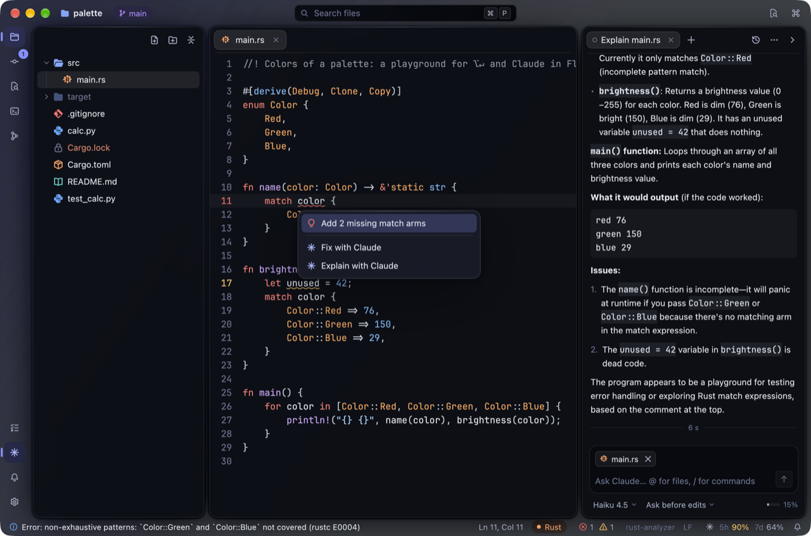

### A terminal built in

Your own shell with its prompt and colours, in a panel under the editor or as a tab next to your
files. Split it, search its output, and ⌘-click a `file:line` from a compiler or a test run to jump
right there. Closing a terminal that still runs something asks first.

### Your project at a glance

A file tree that hides what Git ignores, follows the file you are editing and updates as files change
on disk. Create, rename, move and delete files right in it — open tabs keep up with renamed and moved
files, and open files pick up changes made outside Flux.

### Git, the way JetBrains IDEs do it

Everything around Git is one shortcut away, and it works with all the repositories in your folder.

**Changes and commit.** Changed lines are marked in the gutter as you type, with a rollback in one
click. The commit window lists your changes with checkboxes for files and even single changes,
remembers your previous messages, amends, and commits and pushes in one go; push shows what is about
to leave.


**A diff you can edit.** Side by side or unified, with changed words highlighted. The right side is
your file: fix it right there, roll back a change with an arrow, tick single changes for the commit.


**Branches in one popup.** Search, recent and favorite branches, local and remote ones grouped by
prefix, tags — and every operation a click away: a checkout that keeps your changes, a new branch,
merge, rebase, compare, push and pull. Update the whole project, fetch, stash and unstash.


**Conflicts.** A merge, a rebase or an unstash that conflicts opens a three-way merge tool: yours, the
result and theirs. The changes that don't conflict are already applied; take a side with an arrow, or
let the magic wand merge what it can.


**History.** The log draws your branches as a graph, filters by branch, author, date, path or text and
shows the details of every commit. Cherry-pick, revert, reset and an interactive rebase are right
there, and so is the history of a file or of the lines you selected.

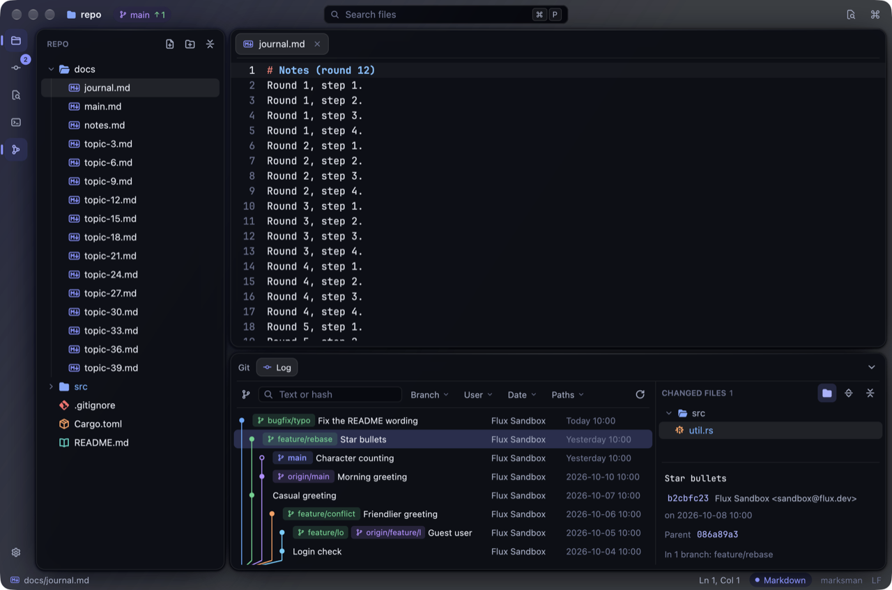

**Who changed each line.** Turn on annotations (<kbd>⌥</kbd><kbd>⌘</kbd><kbd>A</kbd>) to see the
author and the date of the last change of every line; hover for the commit, click to find it in the
log.

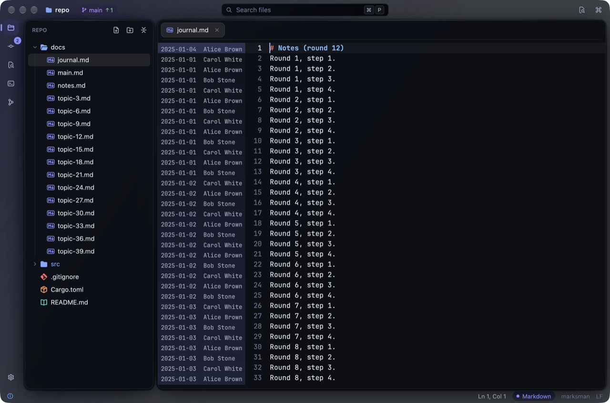

### Never lose a message

Results of Git operations, errors with their full output, language servers installed or stopped, files
changed on disk — all land in one Notifications window with the time, the source and the actions;
unread ones are counted on the bell. Choose per source how much you see: a card that fades, one that
stays, only the journal, or nothing — or turn on Do Not Disturb.

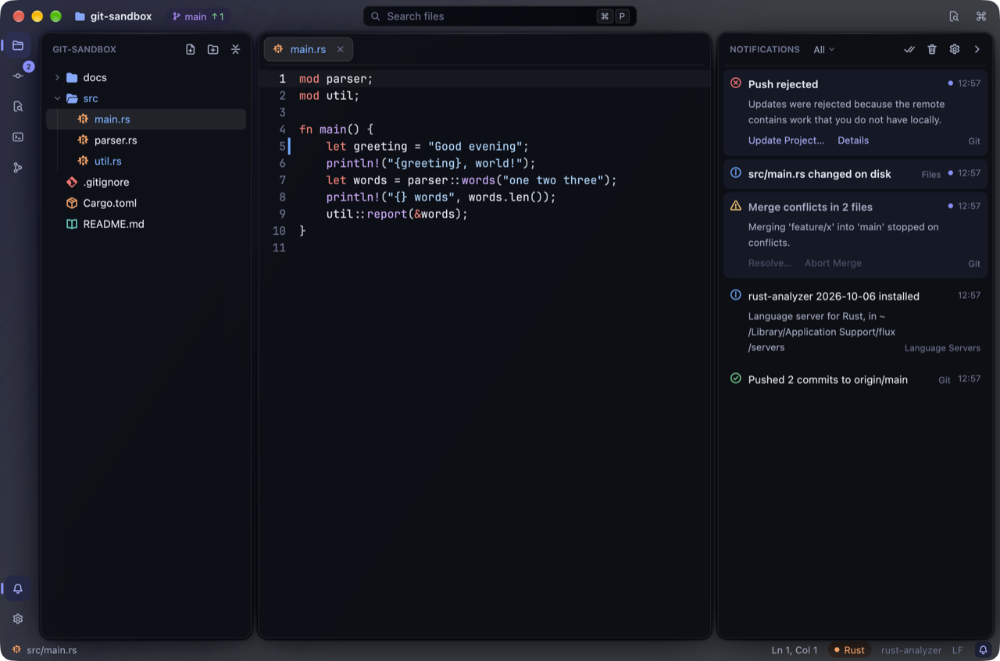

Questions come in Flux's own dialogs that look like the rest of the editor, with the keys you expect
from macOS.

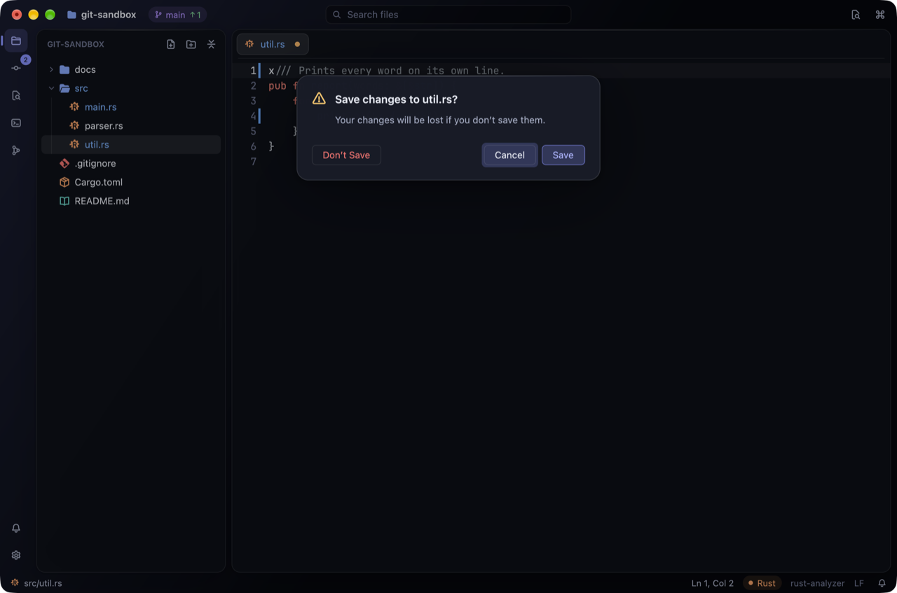

### Plugins that can't break your editor

Each plugin runs in its own WebAssembly sandbox: it can't crash or freeze Flux, and it reaches only
what you allowed when you installed it. Turn plugins on and off without a restart, install one from a
folder or an archive, read its log — all in Settings → Plugins.

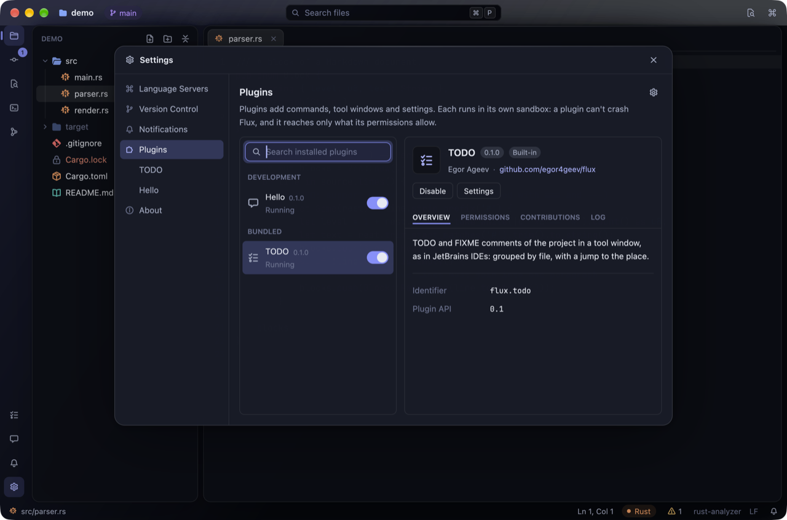

Plugins add commands with shortcuts, tool windows, status bar items, settings pages and items of the
context menus, and look like the rest of Flux. A TODO window comes built in; write your own in Rust —
see [Writing plugins](docs/plugins.md).

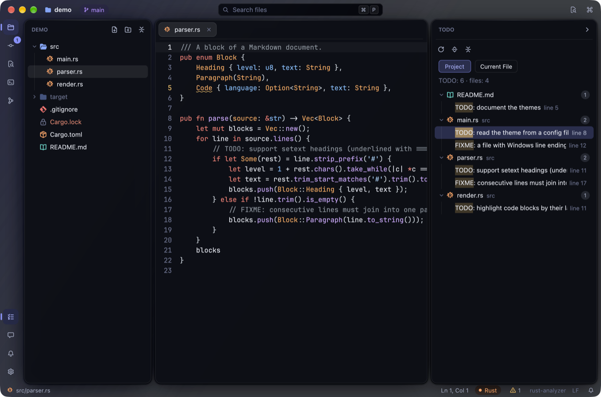

A plugin can work with the world outside the editor: call a web service and sign in to it, run a
local server for a tool or an AI agent to talk to, run programs and terminals, propose an edit you
review as a diff, read Git and the problems in your code, and show problems of its own. It gets
only what you allowed: when you install it, Flux lists in plain words which sites it may reach,
which programs it may run and which folders it may read, and points out what deserves a second
look.

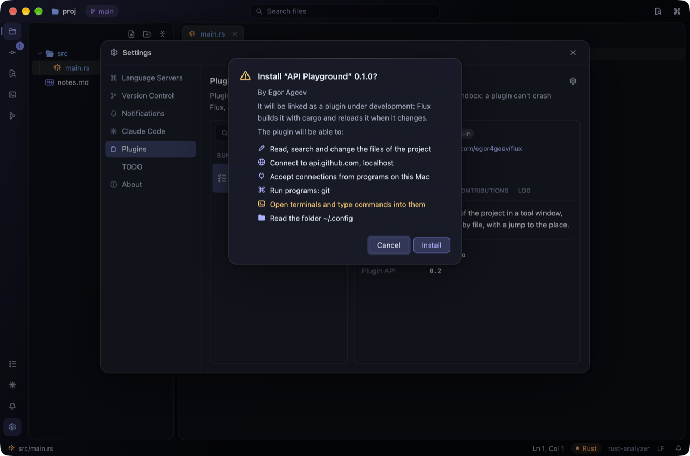

### Claude Code, built in

Talk to Claude in a window on the right (<kbd>⌘</kbd><kbd>Esc</kbd>), or move the chat to a tab next
to your files. The answer streams in, with every file Claude reads and every command it runs shown as
it happens. Claude asks before it changes anything: each edit opens as a diff you can trim or edit
before you accept it — and Claude learns what you changed.

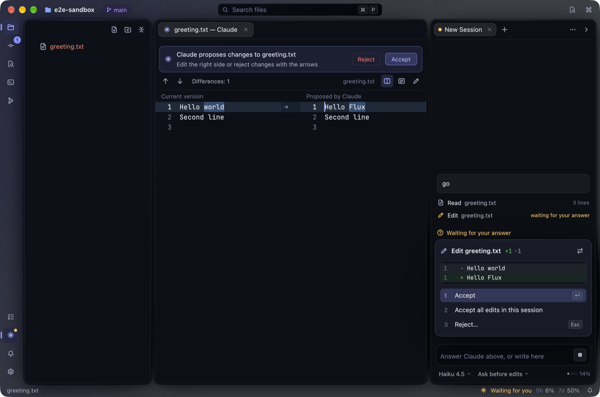

Answer Claude's questions and approve its plans with a click or a key. Mention files with `@` or send
your selection (<kbd>⌥</kbd><kbd>⌘</kbd><kbd>K</kbd>), paste screenshots, pick the model, the effort
and the mode, and keep an eye on your subscription's limits in the status bar. Flux runs your own
`claude` command with your Claude subscription — no API key.

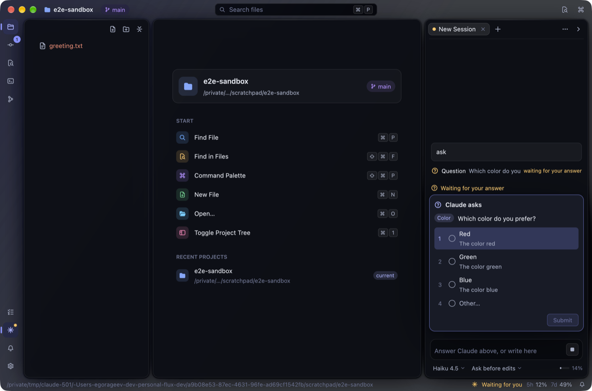

Ask about code right where it is: from the editor's menu or <kbd>⌥</kbd><kbd>↵</kbd>, Claude explains
the selection, fixes the errors in it, looks for bugs, writes tests or documentation — each request in
a fresh session named after it. Send files and folders from the tree or a tab, or drop them on the chat.
Claude sees what Flux sees: it asks the language servers for errors, definitions and usages, and learns
about the errors its edit caused right after making it.

Everything Claude changed in a session gathers in its own changelist in the commit window. Compare a
file with its text before Claude, roll back a file or a single change, and commit Claude's work with
one checkbox — Claude can even write the commit message, in the style of your history.

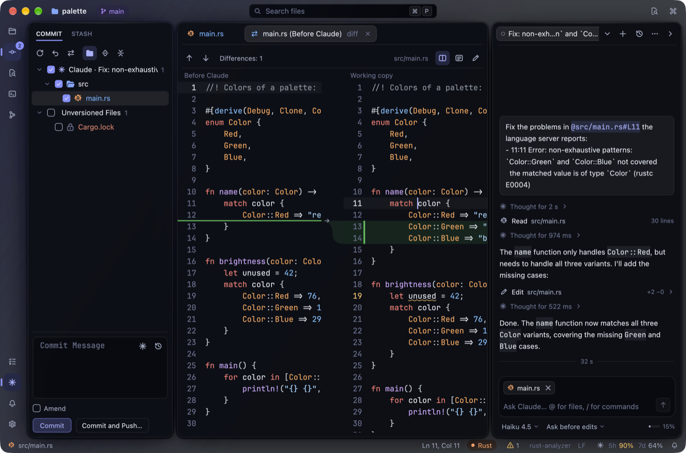

Pick up any earlier conversation of the project — started in Flux or in the terminal — from the history
(or type `/resume`), and the sessions you had open come back when you reopen the project.

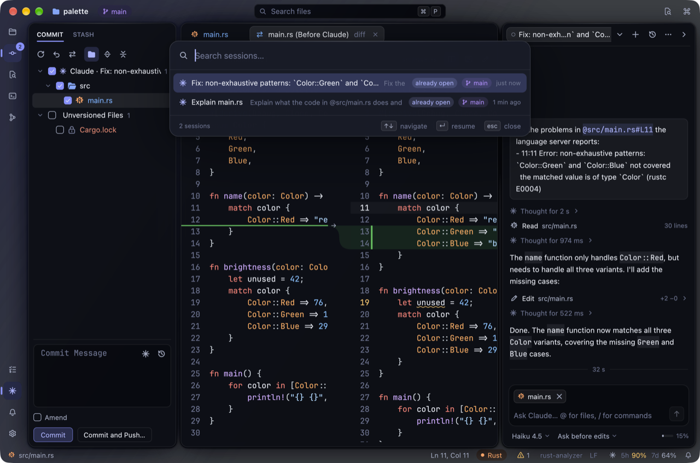

### Keyboard first, in your language

Every command is in the command palette with its shortcut, and the keys are familiar if you come from
JetBrains IDEs. The interface speaks English or Russian, following your system settings.

## Get started

```sh
git clone git@github.com:egor4geev/flux.git
cd flux
scripts/bundle-macos.sh
open target/release/Flux.app
```

You will need [Rust](https://rustup.rs) with the WebAssembly target for the built-in plugins:
`rustup target add wasm32-wasip2` (without it Flux still builds, just without them). Open a folder
with <kbd>⌘</kbd><kbd>O</kbd> or pick a recent project on the start screen. For Claude, install
[Claude Code](https://code.claude.com) and sign in once; <kbd>⌘</kbd><kbd>Esc</kbd> opens the chat.

## Shortcuts

| | |
|---|---|
| <kbd>⌘</kbd><kbd>P</kbd> | Find a file |
| <kbd>⇧</kbd><kbd>⌘</kbd><kbd>F</kbd> | Find in Files |
| <kbd>⇧</kbd><kbd>⌘</kbd><kbd>P</kbd> | All commands |
| <kbd>⌘</kbd><kbd>F</kbd> · <kbd>⌘</kbd><kbd>R</kbd> | Find · replace in a file |
| <kbd>⌘</kbd><kbd>B</kbd> · <kbd>⌥</kbd><kbd>F7</kbd> | Go to definition · find usages |
| <kbd>⌥</kbd><kbd>↵</kbd> | Quick fixes and context actions, Fix with Claude |
| <kbd>⇧</kbd><kbd>F6</kbd> | Rename everywhere |
| <kbd>⌘</kbd><kbd>1</kbd> | Show or hide the project tree |
| <kbd>⌥</kbd><kbd>F12</kbd> · <kbd>⌘</kbd><kbd>T</kbd> | Show or hide the terminal · new terminal |
| <kbd>⌘</kbd><kbd>K</kbd> · <kbd>⇧</kbd><kbd>⌘</kbd><kbd>K</kbd> | Commit · push |
| <kbd>⇧</kbd><kbd>⌘</kbd><kbd>B</kbd> · <kbd>⌘</kbd><kbd>T</kbd> | Branches · update the project (in a terminal, ⌘T opens a new one) |
| <kbd>⌘</kbd><kbd>0</kbd> · <kbd>⌃</kbd><kbd>V</kbd> | Show or hide the commit window · Git operations |
| <kbd>⌘</kbd><kbd>9</kbd> · <kbd>⌥</kbd><kbd>⌘</kbd><kbd>A</kbd> | Show or hide the Git log · who changed each line |
| <kbd>⌘</kbd><kbd>Esc</kbd> · <kbd>⌥</kbd><kbd>⌘</kbd><kbd>K</kbd> | Claude · mention the selection in Claude's message |

## Roadmap

- [x] Editing, tabs, syntax highlighting
- [x] Search and navigation
- [x] Project tree
- [x] New look
- [x] Code intelligence: errors, completion, go to definition
- [x] Built-in terminal
- [x] Git: changes, diff, commit and push
- [x] Git: branches, stash, conflicts
- [x] Git: history and blame
- [x] Notification center and unified dialogs
- [x] Plugins: sandboxed plugins, the plugin manager, a TODO window
- [x] Claude Code: a chat that runs your `claude`, with every edit as a diff
- [x] Claude Code: a review of Claude's changes, session history, the editor's menu
- [x] Plugins: web services, programs, terminals, edits to review, context menus — with your permission
- [ ] Plugins: a catalog, themes, file icons and languages as plugins; Appearance settings
- [ ] Public beta

## License

MIT
