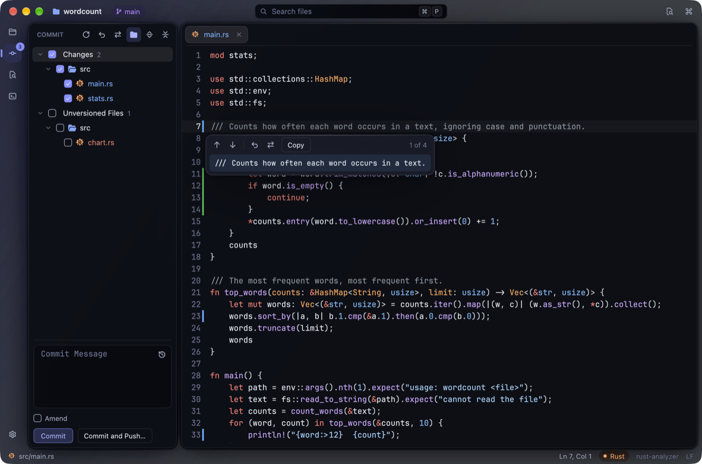
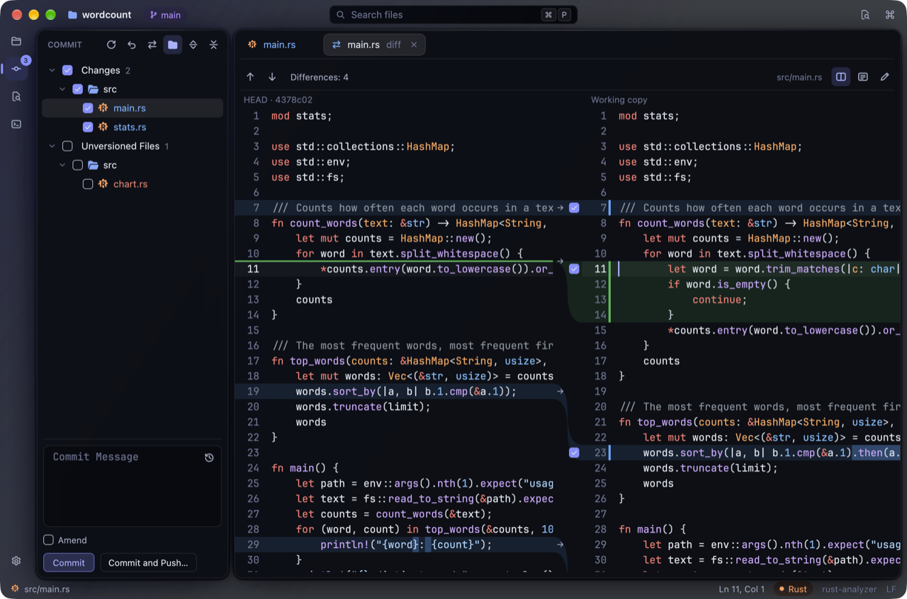
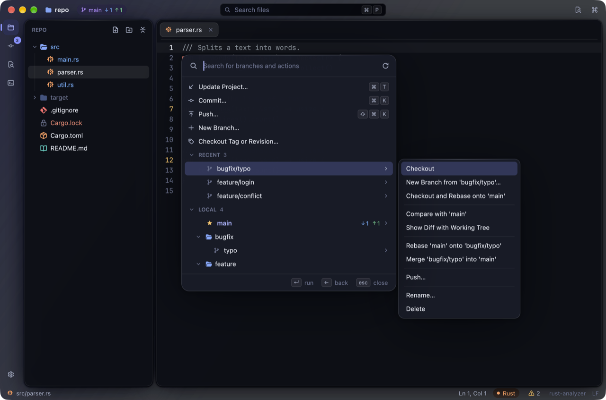
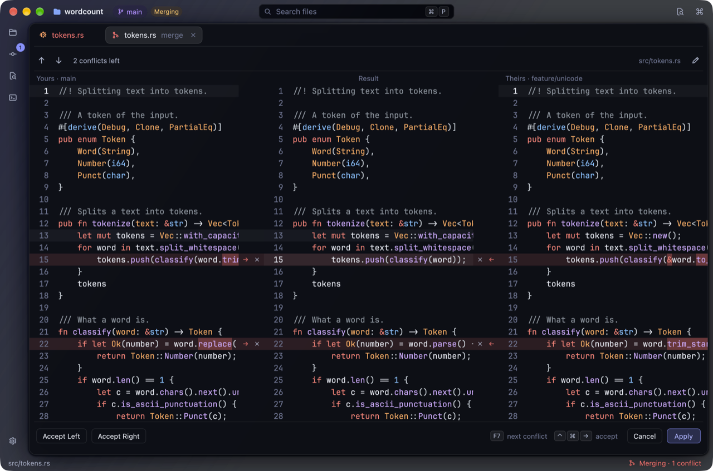

<div align="center">


# Flux

**A fast, minimal code editor for macOS.**


</div>

<p align="center">
  
</p>

Flux is a code editor that gets out of your way. It opens instantly, stays responsive on huge files
and keeps everything you need one shortcut away — no setup, no clutter.

> [!NOTE]
> Flux is in early development. It runs on macOS today; more platforms will follow.

## Why Flux

- **Fast.** Typing, scrolling and searching never wait — even in files with tens of thousands of lines.
- **Calm and clear.** Your project and your code live in separate panels on a soft glass window.
  Colour is used for meaning: every file type has its own icon.
- **Find anything.** Jump to a file by a few letters, search the whole project with a live preview,
  find and replace inside a file.
- **Understands your code.** Errors as you type, completion, documentation on hover, go to
  definition, find usages, rename and reformat — with the language servers you already have
  (rust-analyzer, gopls and others), started automatically.
- **A terminal built in.** Your own shell with its prompt and colours, in a panel under the editor or as
  a tab next to your files. Split it, search its output, and ⌘-click a `file:line` from a compiler or a
  test run to jump right there.
- **Your project at a glance.** A file tree that hides what Git ignores, updates as files change on
  disk and keeps your open tabs in sync when you rename or move files. Open files pick up changes made
  outside Flux.
- **Git, the way JetBrains IDEs do it.** Changed lines marked as you type, with rollback in one click; a
  diff you can edit; a commit window with checkboxes for files and even single changes, amend and
  commit-and-push; push with a preview of what goes. Branches in one popup — search, favorites, every
  operation a click away, checkout that keeps your changes; update, pull and fetch; stash and unstash;
  conflicts resolved in a three-way merge tool. Works with all the repositories in your folder.
- **Keyboard first.** Every command is in the command palette with its shortcut; familiar keys if
  you come from JetBrains IDEs.
- **Speaks your language.** English or Russian, following your system settings.

<table>
  <tr>
    <td width="50%"></td>
    <td width="50%"></td>
  </tr>
  <tr>
    <td align="center"><sub><b>Start screen</b></sub></td>
    <td align="center"><sub><b>Find in Files</b></sub></td>
  </tr>
  <tr>
    <td width="50%"></td>
    <td width="50%"></td>
  </tr>
  <tr>
    <td align="center"><sub><b>Commit window and changed lines</b></sub></td>
    <td align="center"><sub><b>Diff with checkboxes for single changes</b></sub></td>
  </tr>
  <tr>
    <td width="50%"></td>
    <td width="50%"></td>
  </tr>
  <tr>
    <td align="center"><sub><b>Branches</b></sub></td>
    <td align="center"><sub><b>Merge tool for conflicts</b></sub></td>
  </tr>
</table>

## Get started

```sh
git clone git@github.com:egor4geev/flux.git
cd flux
scripts/bundle-macos.sh
open target/release/Flux.app
```

You will need [Rust](https://rustup.rs). Open a folder with <kbd>⌘</kbd><kbd>O</kbd> or pick a
recent project on the start screen.

## Shortcuts

| | |
|---|---|
| <kbd>⌘</kbd><kbd>P</kbd> | Find a file |
| <kbd>⇧</kbd><kbd>⌘</kbd><kbd>F</kbd> | Find in Files |
| <kbd>⇧</kbd><kbd>⌘</kbd><kbd>P</kbd> | All commands |
| <kbd>⌘</kbd><kbd>F</kbd> · <kbd>⌘</kbd><kbd>R</kbd> | Find · replace in a file |
| <kbd>⌘</kbd><kbd>B</kbd> · <kbd>⌥</kbd><kbd>F7</kbd> | Go to definition · find usages |
| <kbd>⇧</kbd><kbd>F6</kbd> | Rename everywhere |
| <kbd>⌘</kbd><kbd>1</kbd> | Show or hide the project tree |
| <kbd>⌥</kbd><kbd>F12</kbd> · <kbd>⌘</kbd><kbd>T</kbd> | Show or hide the terminal · new terminal |
| <kbd>⌘</kbd><kbd>K</kbd> · <kbd>⇧</kbd><kbd>⌘</kbd><kbd>K</kbd> | Commit · push |
| <kbd>⇧</kbd><kbd>⌘</kbd><kbd>B</kbd> · <kbd>⌘</kbd><kbd>T</kbd> | Branches · update the project (in a terminal, ⌘T opens a new one) |
| <kbd>⌘</kbd><kbd>0</kbd> · <kbd>⌃</kbd><kbd>V</kbd> | Show or hide the commit window · Git operations |

## Roadmap

- [x] Editing, tabs, syntax highlighting
- [x] Search and navigation
- [x] Project tree
- [x] New look
- [x] Code intelligence: errors, completion, go to definition
- [x] Built-in terminal
- [x] Git: changes, diff, commit and push
- [x] Git: branches, stash, conflicts
- [ ] Git: history and blame
- [ ] Notification center and unified dialogs
- [ ] Plugins
- [ ] Claude Code integration — the first plugin
- [ ] Public beta

## License

MIT
